# Pipeline Server 아키텍처 설계 문서

> 자율주행 영상 데이터의 **정제 - 통합 - 검색**을 제공하는 파이프라인 서버

---

## 한눈에 보기

```
Client ─── POST /analyze ───> FastAPI ───> MongoDB(원본 저장) + Outbox(이벤트)
                                                │
                                    Celery Beat (5초 폴링)
                                                │
                                          Celery Worker
                                                │
                               ┌────────────────┼────────────────┐
                               v                v                v
                          [SELECTION]     [ODD_TAGGING]    [AUTO_LABELING]
                               │                │                │
                               └──── MySQL (정제 데이터 적재) ────┘
                                                │
Client ─── GET /data ───────> FastAPI ───> MySQL (복합 조건 검색)
```

| 기술 | 역할 |
|---|---|
| FastAPI | REST API (4개 엔드포인트) |
| Celery + Beat | 비동기 파이프라인 + 주기 스케줄러 |
| MongoDB | 원본 보관, 작업 상태, Outbox |
| MySQL | 정제 데이터 저장, 복합 검색 |
| Redis | Celery 브로커 + 캐시 |

---

## 1. 아키텍처 개요

### 1.1 왜 DDD + Hexagonal Architecture인가

이 프로젝트는 네 가지 복잡성을 동시에 다룬다. 각 복잡성을 아키텍처가 어떻게 흡수하는지 정리한다.

| 복잡성 | 아키텍처 대응 |
|---|---|
| 3종 파일의 정제 규칙이 복잡하다 | Domain 레이어에 규칙을 격리 |
| MongoDB + MySQL + Redis 다중 저장소 | Port/Adapter로 구현체 교체 가능 |
| REST + Worker 두 진입점 | Inbound Adapter 분리, Application 공유 |
| 대용량 비동기 처리 | Outbox + Worker, 도메인과 인프라 분리 |

### 1.2 레이어 구조

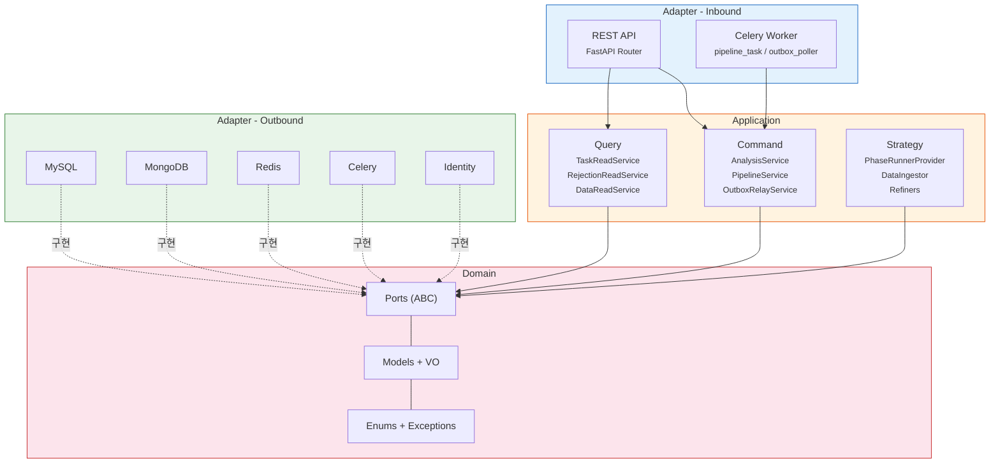

### 1.3 의존성 방향 규칙

**원칙**: 의존성은 항상 안쪽(Domain)으로만 흐른다.

```
 Inbound Adapter ──> Application ──> Domain <── Outbound Adapter (Port 구현)
```

아래는 전체 `app/` 디렉토리를 대상으로 실제 import 문을 검사한 결과이다.

| 레이어 | 규칙 | 결과 | 비고 |
|---|---|---|---|
| Domain (6파일) | 표준 라이브러리만 허용 | PASS | `dataclasses`, `datetime`, `abc`, `enum`만 사용 |
| Application (14파일) | Domain Port만 의존 | PASS | `app.adapter` import 0건 |
| Inbound REST | dependencies.py 통한 DI | PASS | |
| Inbound Worker | Application만 사용해야 함 | **VIOLATION** | 아래 상세 |
| Outbound | Domain Port 구현 | PASS | |

> **VIOLATION  Worker -> Outbound 직접 의존**
>
> Celery Worker는 FastAPI `Depends()`를 사용할 수 없어,
> `_build_pipeline_service()` 헬퍼에서 Outbound 구현체를 직접 import한다.
>
> - `pipeline_task.py` : outbound 9건 직접 import
> - `outbox_poller_task.py` : outbound 3건 직접 import
>
> **판단**: 비즈니스 로직은 Application에 완전히 위임되어 있으므로 실질적 문제는 없다.
> `dependencies.py`의 Worker 버전 역할을 하는 의도적 설계 타협이나,
> 구조적으로는 `inbound -> outbound` 직접 참조이므로 위반으로 기록한다.

---

## 2. 데이터 흐름 다이어그램

이 장에서는 4개 API 엔드포인트 각각의 흐름을 시퀀스 다이어그램으로 보여준다.

### 2.1 POST /analyze -- 비동기 파이프라인 전체 흐름

가장 복잡한 흐름이다. **동기 접수**(202 반환)와 **비동기 실행**(Worker) 두 페이즈로 나뉜다.

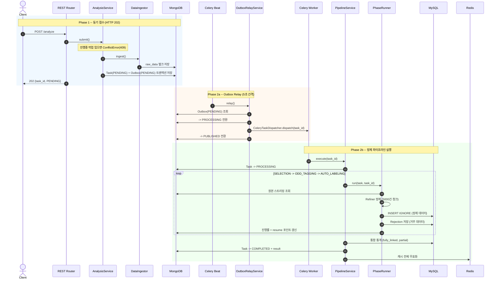

### 2.2 GET /analyze/{task_id} -- 진행 상태 조회

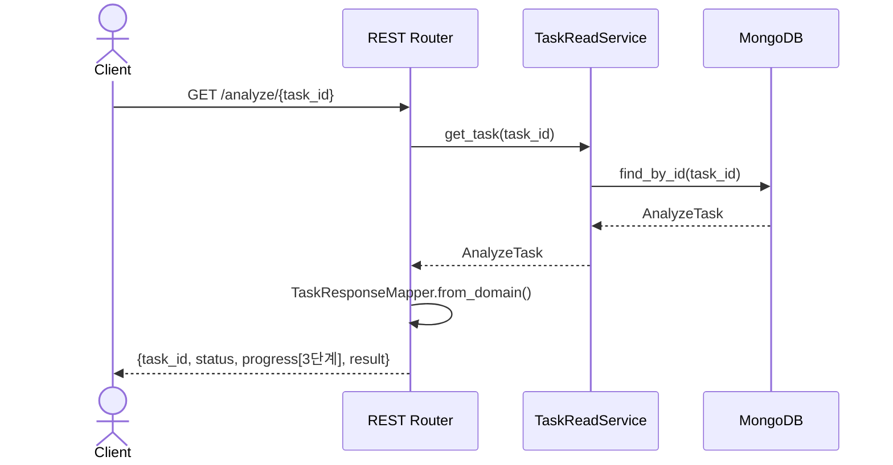

### 2.3 GET /data -- 학습 데이터 검색

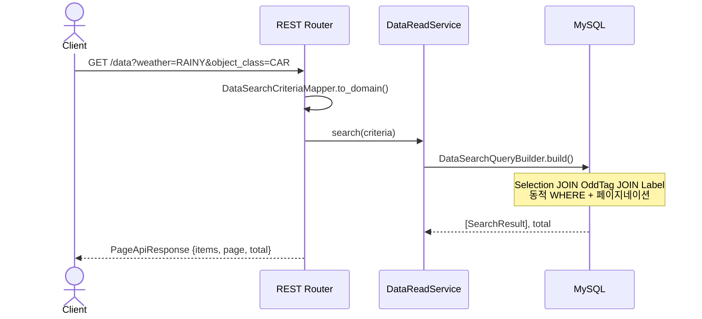

### 2.4 GET /rejections -- 거부 데이터 조회

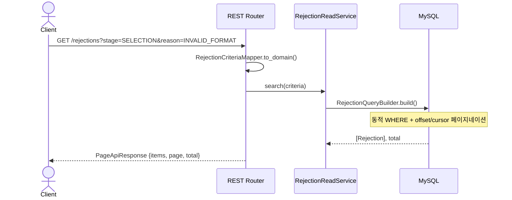

---

## 3. Polyglot Persistence 설계

세 가지 저장소가 각자 가장 잘 맞는 역할을 담당한다.

### 3.1 저장소별 역할

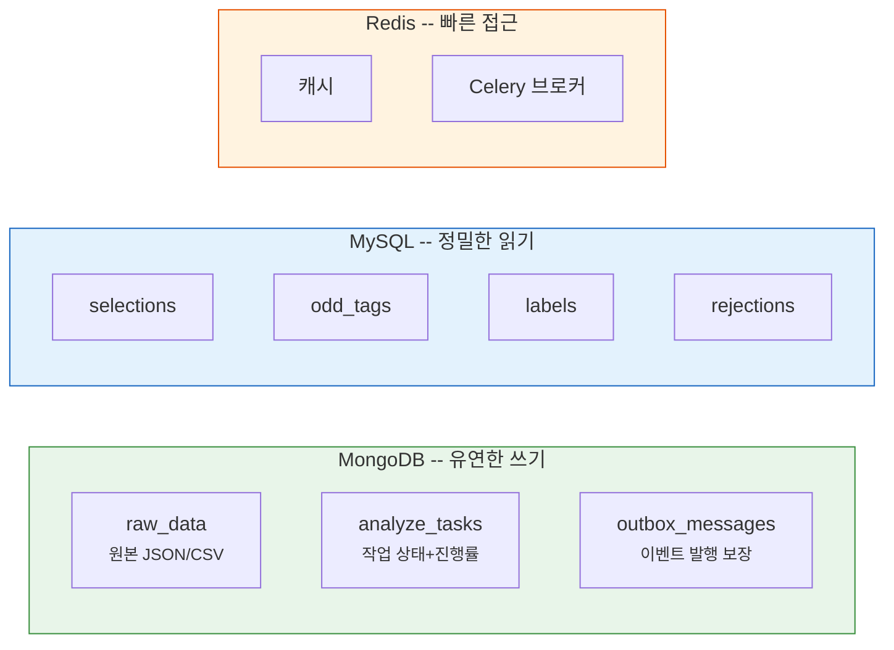

**왜 이렇게 나눴는가:**

| 저장소 | 선택 이유 |
|---|---|
| MongoDB | 스키마리스 -> 원본 파일을 변환 없이 저장. Replica Set 트랜잭션으로 Task+Outbox 원자적 저장 |
| MySQL | 정규화 스키마 -> 날씨+객체+신뢰도 복합 조건 검색 최적화. UNIQUE 제약으로 중복 방지 |
| Redis | 인메모리 -> 캐시 무효화 + Celery 메시지 브로커 |

### 3.2 크로스 저장소 일관성 전략

MongoDB(원본) -> MySQL(정제본) 간 일관성을 **두 가지 패턴**으로 보장한다.

#### Transactional Outbox -- "이벤트 유실 방지"

```
 AnalysisService.submit()
 ┌─────────────────────────────────────────┐
 │  MongoDB 트랜잭션                         │
 │    1. RawData 벌크 저장                   │
 │    2. AnalyzeTask(PENDING) 저장           │
 │    3. OutboxMessage(PENDING) 저장         │
 └─────────────────────────────────────────┘
                    │
          (Celery Beat 5초 폴링)
                    v
 OutboxRelayService.relay()
    PENDING -> PROCESSING -> dispatch -> PUBLISHED
```

Task 생성과 이벤트 저장을 하나의 트랜잭션으로 묶어, "Task는 생성됐지만 이벤트가 유실되는" 상황을 원천 차단한다.

#### Resume 보상 패턴 -- "실패 시 이어서 재개"

```
 PipelineService.execute()
    Phase 완료마다 -> task.with_completed_phase(stage) -> MongoDB 저장
                                                          (체크포인트)
 실패 후 Celery 자동 재시도:
    task.should_run_phase(stage) 확인
    -> last_completed_phase 이후 Phase만 실행
    -> INSERT IGNORE로 이미 적재된 데이터 자동 스킵 (멱등성)
```

### 3.3 데이터가 어디에 저장되는가

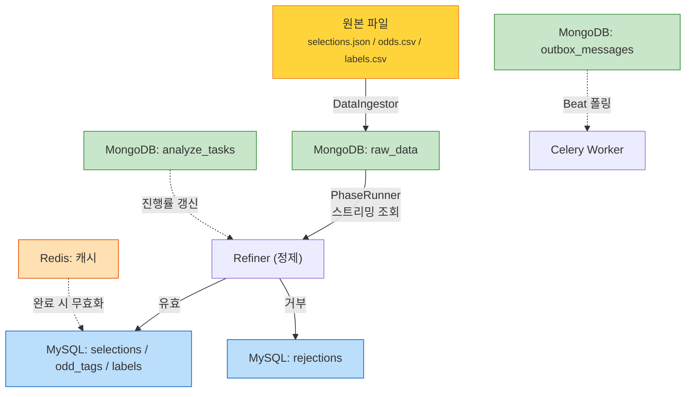

---

## 4. 핵심 설계 패턴

### 4.1 Repository: save/find만, 비즈니스 로직 금지

Port(ABC)에는 저장/조회 메서드만 정의한다. **상태 전이는 도메인 객체가 담당**한다.

```python
# app/domain/ports.py
class TaskRepository(ABC):
    """Repository는 저장/조회만 수행한다.
    상태 전이는 도메인 객체(AnalyzeTask)가 담당한다."""

    def save(self, task: AnalyzeTask) -> None: ...
    def find_by_id(self, task_id: str) -> AnalyzeTask | None: ...
```

### 4.2 frozen dataclass + dataclasses.replace

모든 도메인 모델은 `@dataclass(frozen=True)`로 **불변**이다.
상태를 바꿀 때는 `dataclasses.replace()`로 새 인스턴스를 만든다.

```python
# app/domain/models.py
task = task.start_processing()                    # PENDING -> PROCESSING
task = task.with_completed_phase(Stage.SELECTION)  # resume 포인트 기록
task = task.complete_with(result)                  # -> COMPLETED

msg = msg.mark_processing()   # PENDING -> PROCESSING
msg = msg.mark_published()    # -> PUBLISHED
```

### 4.3 PhaseRunner + Provider (전략 패턴)

파이프라인의 3개 Stage를 **전략 패턴**으로 분리한다.
공통 로직(스트리밍, 청크, 진행률)은 `PhaseRunner` ABC에, 정제/저장은 하위 클래스에 위임한다.

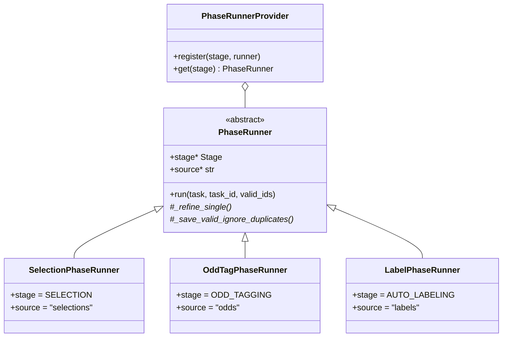

**`run()` 템플릿 메서드 흐름:**

```
1. MongoDB에서 스트리밍 조회   ─ find_by_task_and_source()
2. 5000건씩 청크 분할           ─ itertools.islice()
3. 개별 row 정제                ─ _refine_single() (Strategy)
4. 유효 데이터 벌크 저장         ─ _save_valid_ignore_duplicates() → INSERT IGNORE
5. 거부 레코드 저장             ─ _rejection_repo.save_all()
6. resume 포인트 기록           ─ task.with_completed_phase()
```

### 4.4 Transactional Outbox + 좀비 복구

OutboxMessage의 상태 전이 전체 흐름:

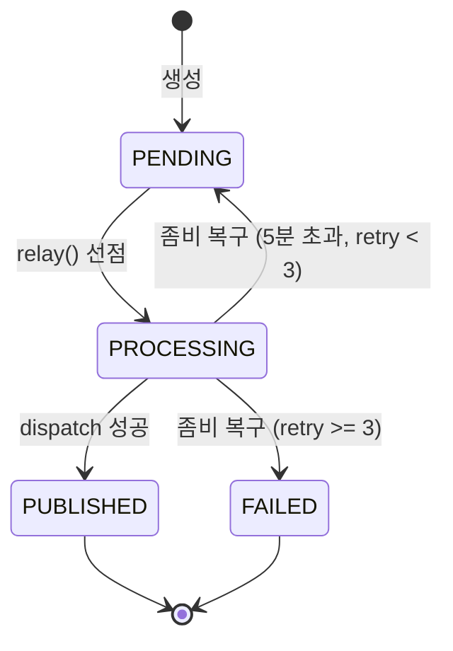

**좀비 복구** (60초 간격):
PROCESSING 상태로 5분 이상 방치된 메시지를 탐지한다.
재시도 가능하면(`retry < 3`) PENDING으로 되돌리고, 초과하면 FAILED로 최종 처리한다.

### 4.5 Refiner: 필드별 에러 수집

각 Refiner는 원본 dict -> 도메인 객체 변환을 시도한다.
성공하면 도메인 객체를, 실패하면 `Rejection`을 반환하여 **에러를 버리지 않고 수집**한다.

```python
# 성공
Selection(id=VideoId(123), temperature=Temperature(25.0), ...)

# 실패 -- 필드별 상세 사유 기록
Rejection(stage=Stage.SELECTION, reason=INVALID_FORMAT,
          field="temperature", detail="범위 초과: 120C")
```

`PhaseRunner._refine_chunk()`에서 반환 타입으로 자동 분류:

| 반환 타입 | 분류 |
|---|---|
| 도메인 객체 | valid (MySQL 적재) |
| `Rejection` | 단일 거부 |
| `list[Rejection]` | 다중 거부 (여러 필드 동시 오류) |

### 4.6 INSERT IGNORE 중복 처리

MySQL `save_all()`은 `INSERT IGNORE`를 사용한다.
UNIQUE 제약 위반 row는 무시하고, **실제 적재 건수를 반환**한다.

```
적재 요청 100건  ->  INSERT IGNORE  ->  실제 적재 95건
                                        무시 5건 = Rejection 기록
```

**효과:**
- 중복 감지를 DB에 위임 (애플리케이션 중복 체크 불필요)
- resume 시 이미 적재된 데이터 자동 스킵 (멱등성 보장)

---

## 5. 비동기 파이프라인 아키텍처

### 5.1 프로세스 구성

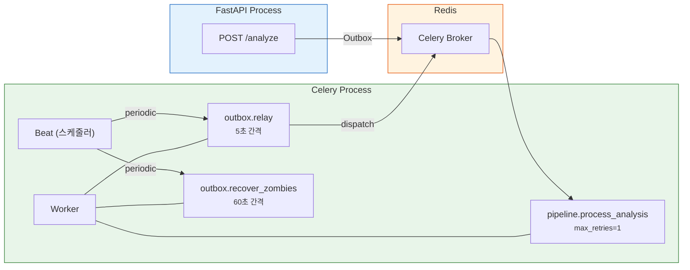

### 5.2 Worker 설정

```python
# app/worker.py
celery_app.conf.update(
    task_acks_late=True,           # 완료 후 ACK (안전)
    worker_prefetch_multiplier=1,  # 1개씩 처리 (대용량)
)

celery_app.conf.beat_schedule = {
    "outbox-relay":           {"schedule": 5.0},   # 5초마다
    "outbox-zombie-recovery": {"schedule": 60.0},  # 60초마다
}
```

### 5.3 Resume 로직

Phase 실행 순서는 고정이다: `SELECTION -> ODD_TAGGING -> AUTO_LABELING`

```
 시나리오                           last_completed_phase    재시도 시 실행 범위
 ────────────────────────────────  ────────────────────    ──────────────────
 최초 실행                          None                    전체 (3개 Phase)
 SELECTION 완료 후 실패              SELECTION               ODD_TAGGING부터
 ODD_TAGGING 완료 후 실패            ODD_TAGGING             AUTO_LABELING만
```

```python
# app/domain/models.py
def should_run_phase(self, phase: Stage) -> bool:
    if self.last_completed_phase is None:
        return True
    return self._STAGE_ORDER.index(phase) > self._STAGE_ORDER.index(self.last_completed_phase)
```

---

## 6. DI (의존성 주입) 전략

두 진입점(REST, Worker)이 **같은 Application 서비스**를 사용하되, DI 방식은 다르다.

### 6.1 REST -- FastAPI Depends 체인

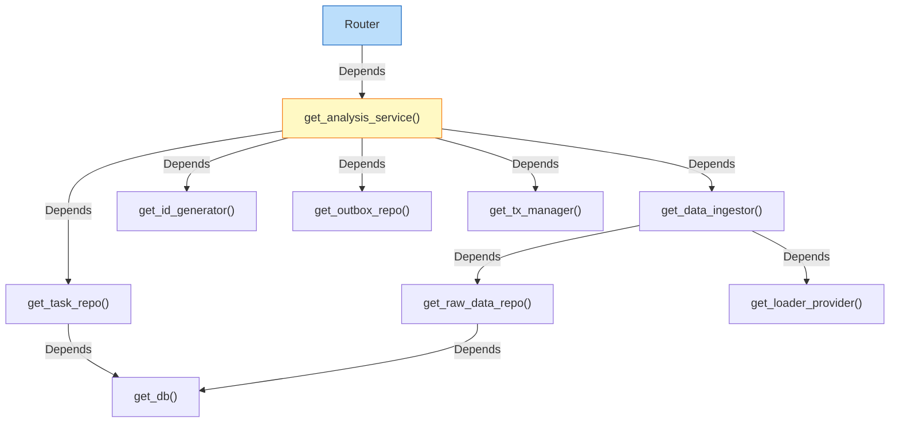

`dependencies.py`는 프로젝트에서 **유일하게** Adapter 구현체를 import하는 모듈이다.
반환 타입은 항상 Port(ABC)이므로, 구현체를 교체해도 호출측은 변경 없다.

```python
# app/dependencies.py
def get_selection_repo(session = Depends(get_db_session)) -> SelectionRepository:
    return SqlSelectionRepository(session)  # 구현체

def get_task_repo(db = Depends(get_db)) -> TaskRepository:
    return MongoTaskRepository(db)          # 구현체
```

### 6.2 Worker -- 수동 DI

Celery는 FastAPI 요청 컨텍스트가 없다. 대신 `_build_*_service()` 팩토리 함수로 직접 조립한다.

```python
# app/adapter/inbound/worker/pipeline_task.py
def _build_pipeline_service(db, session) -> PipelineService:
    """Worker 전용 DI -- dependencies.py의 Worker 버전"""
    raw_data_repo = MongoRawDataRepository(db)
    task_repo = MongoTaskRepository(db)
    # ... 구현체를 직접 생성하여 서비스에 주입
    return PipelineService(task_repo=task_repo, ...)
```

| 진입점 | DI 방식 | 조립 위치 |
|---|---|---|
| REST API | `Depends()` 자동 체인 | `app/dependencies.py` |
| Celery Worker | `_build_*()` 수동 조립 | `app/adapter/inbound/worker/*.py` |

### 6.3 Provider 패턴

전략 객체를 런타임에 등록하고 키로 조회한다. `PhaseRunnerProvider`와 `FileLoaderProvider` 두 곳에서 사용한다.

```python
# Stage -> PhaseRunner
provider = PhaseRunnerProvider()
provider.register(Stage.SELECTION, SelectionPhaseRunner(...))
provider.register(Stage.ODD_TAGGING, OddTagPhaseRunner(...))
provider.register(Stage.AUTO_LABELING, LabelPhaseRunner(...))

# FileType -> FileLoader
loader = FileLoaderProvider()
loader.register(FileType.JSON, JsonFileLoader())
loader.register(FileType.CSV, CsvFileLoader())
```

---

## 부록: 파일 구조

```
app/
├── main.py                           # FastAPI + 예외 핸들러
├── worker.py                         # Celery + Beat 스케줄
├── dependencies.py                   # DI 조립 (구현체 import 유일 허용)
│
├── domain/                           # 비즈니스 규칙 (외부 의존 없음)
│   ├── models.py                     #   Selection, OddTag, Label, AnalyzeTask, OutboxMessage
│   ├── value_objects.py              #   VideoId, Temperature, Confidence, ObjectCount ...
│   ├── enums.py                      #   Stage, TaskStatus, Weather, ObjectClass ...
│   ├── exceptions.py                 #   DomainError, ConflictError ...
│   └── ports.py                      #   Repository ABC, TransactionManager ...
│
├── application/                      # 유스케이스
│   ├── analysis_service.py           #   POST /analyze 접수 (Command)
│   ├── pipeline_service.py           #   파이프라인 오케스트레이터
│   ├── outbox_relay_service.py       #   Outbox 폴링 + 좀비 복구
│   ├── phase_runners.py              #   PhaseRunner (Strategy) + Provider
│   ├── data_ingestor.py              #   파일 적재 + FileLoaderProvider
│   ├── file_loaders.py               #   JsonFileLoader, CsvFileLoader
│   ├── selection_refiner.py          #   Selection 정제
│   ├── odd_tag_refiner.py            #   ODD 태깅 정제
│   ├── label_refiner.py              #   Label 정제
│   ├── task_read_service.py          #   작업 상태 조회 (Query)
│   ├── rejection_read_service.py     #   거부 데이터 조회 (Query)
│   ├── data_read_service.py          #   학습 데이터 검색 (Query)
│   └── decorators.py                 #   @transactional
│
└── adapter/
    ├── inbound/
    │   ├── rest/
    │   │   ├── routers.py            #   4개 엔드포인트
    │   │   ├── schemas.py            #   Pydantic 요청/응답
    │   │   └── mappers.py            #   Domain <-> DTO
    │   └── worker/
    │       ├── pipeline_task.py      #   Celery task (정제)
    │       └── outbox_poller_task.py  #   Celery task (Outbox)
    │
    └── outbound/
        ├── mysql/                    #   SQLAlchemy (entities, repos, mappers, query_builder)
        ├── mongodb/                  #   PyMongo (docs, repos, mappers, transaction, client)
        ├── redis/                    #   Redis (repos, serializer, client)
        ├── celery/                   #   CeleryTaskDispatcher
        └── identity/                 #   UUIDv7Generator
```
