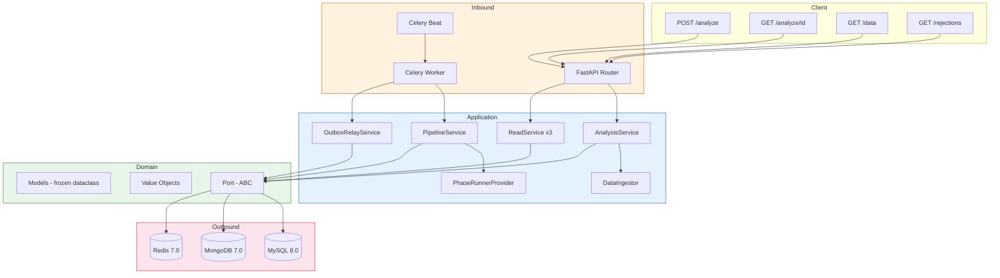
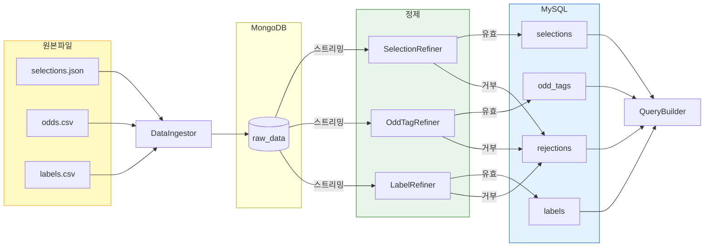
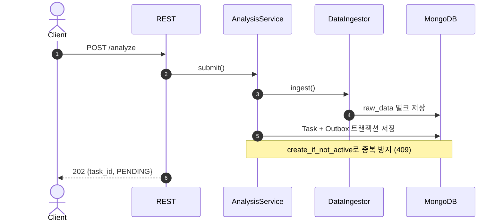
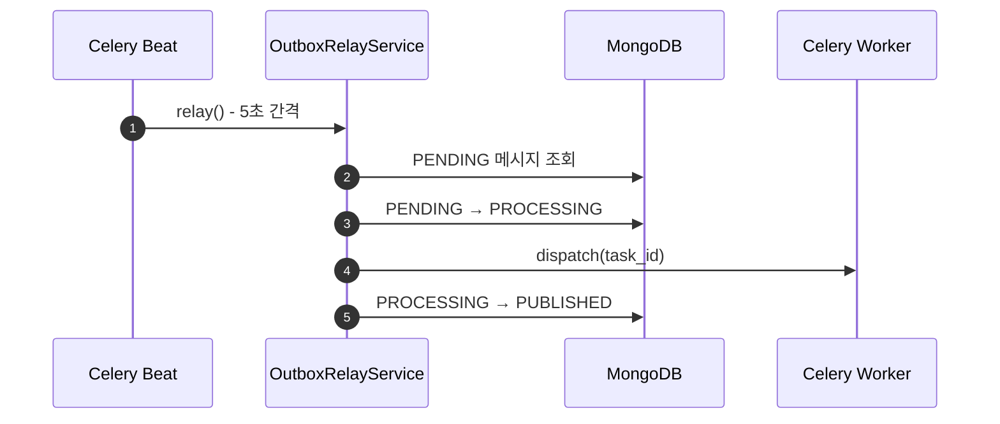
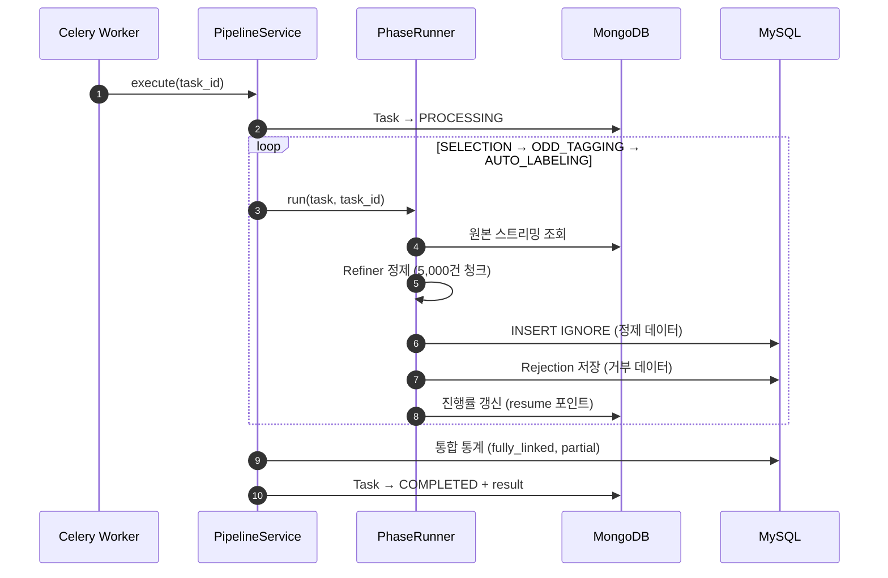
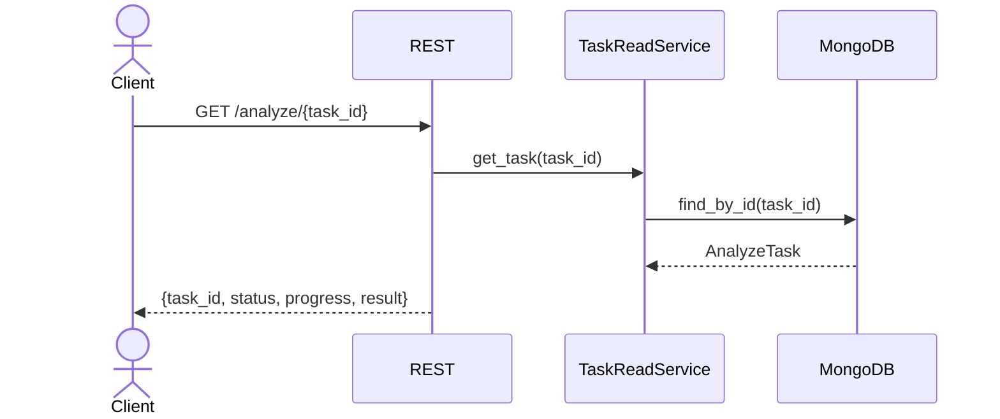
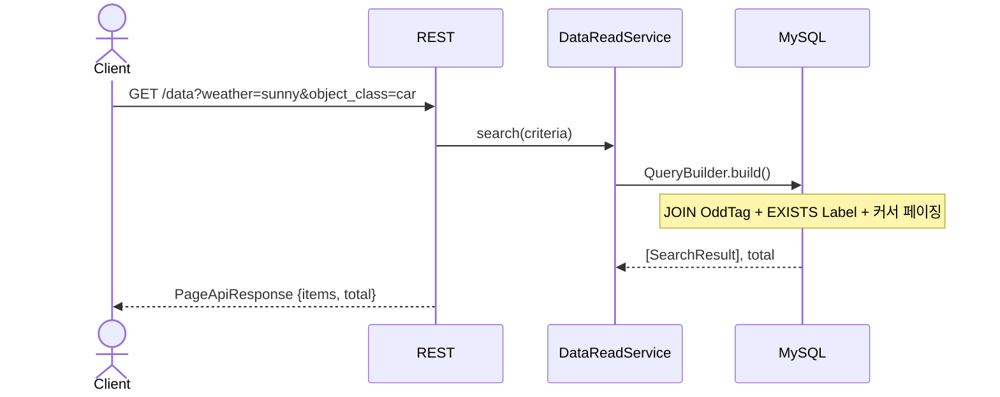
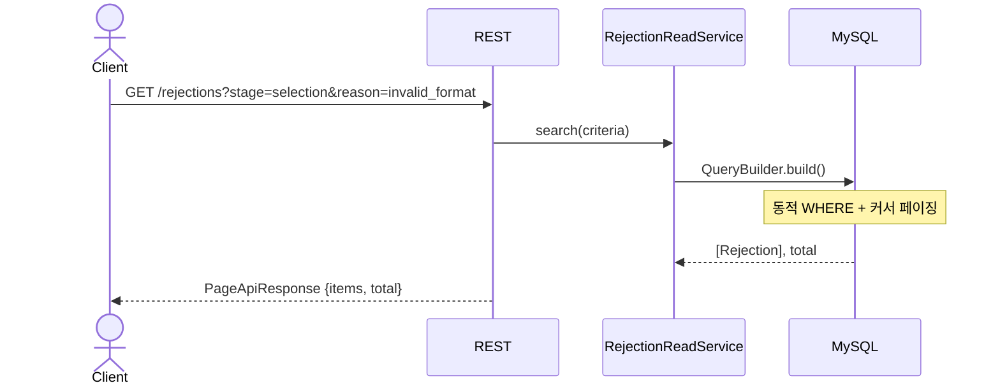

# Pipeline Server 아키텍처 설계 문서

> 자율주행 영상 데이터의 **정제 - 통합 - 검색**을 제공하는 파이프라인 서버

---

## 한눈에 보기

```
Client ─── POST /analyze ───> FastAPI ───> MongoDB(원본 저장) + Outbox(이벤트)
                                                │
                                    Celery Beat (5초 폴링)
                                                │
                                          Celery Worker
                                                │
                               ┌────────────────┼────────────────┐
                               v                v                v
                          [SELECTION]     [ODD_TAGGING]    [AUTO_LABELING]
                               │                │                │
                               └──── MySQL (정제 데이터 적재) ────┘
                                                │
Client ─── GET /data ───────> FastAPI ───> MySQL (복합 조건 검색)
```

| 기술 | 역할 |
|---|---|
| FastAPI | REST API (4개 엔드포인트) |
| Celery + Beat | 비동기 파이프라인 + 주기 스케줄러 |
| MongoDB | 원본 보관, 작업 상태, Outbox |
| MySQL | 정제 데이터 저장, 복합 검색 |
| Redis | Celery 메시지 브로커 |

### 시스템 컴포넌트 다이어그램



| 컴포넌트 | 설명 |
|----------|------|
| **FastAPI Router** | 4개 엔드포인트, Pydantic Schema + Mapper |
| **Celery Worker** | pipeline_task, outbox_poller_task |
| **Celery Beat** | relay(5초), recover_zombies(60초) |
| **AnalysisService** | 접수 + Outbox 발행 |
| **PipelineService** | 3단계 Phase 오케스트레이션 |
| **PhaseRunnerProvider** | Selection · OddTag · Label 전략 패턴 |
| **DataIngestor** | 파일 → MongoDB 적재 (5,000건 청크) |
| **Models** | Selection, OddTag, Label, Rejection, AnalyzeTask |
| **Value Objects** | VideoId, Temperature, Confidence, ObjectCount |
| **Port ABC** | Repository, Dispatcher, TransactionManager |
| **MySQL 8.0** | SQLAlchemy, INSERT IGNORE 배치, 복합 인덱스 |
| **MongoDB 7.0** | PyMongo, Replica Set 트랜잭션 |
| **Redis 7.0** | Celery 메시지 브로커 |

### 파이프라인 데이터 흐름



| 단계 | 처리 |
|------|------|
| **적재** | DataIngestor가 3개 파일을 5,000건 청크로 MongoDB에 적재 |
| **SelectionRefiner** | V1/V2 스키마 자동 감지, 화씨→섭씨 변환 |
| **OddTagRefiner** | Weather/TimeOfDay/RoadSurface Enum 검증, video_id 정규화 |
| **LabelRefiner** | obj_count 정수 검증, confidence 범위 검증 |
| **QueryBuilder** | 동적 JOIN + EXISTS 서브쿼리, 커서/오프셋 페이징 |

---

## 1. 아키텍처 개요

### 1.1 왜 DDD + Hexagonal Architecture인가

이 프로젝트는 네 가지 복잡성을 동시에 다룬다. 각 복잡성을 아키텍처가 어떻게 흡수하는지 정리한다.

| 복잡성 | 아키텍처 대응 |
|---|---|
| 3종 파일의 정제 규칙이 복잡하다 | Domain 레이어에 규칙을 격리 |
| MongoDB + MySQL + Redis 다중 저장소 | Port/Adapter로 구현체 교체 가능 |
| REST + Worker 두 진입점 | Inbound Adapter 분리, Application 공유 |
| 대용량 비동기 처리 | Outbox + Worker, 도메인과 인프라 분리 |

> 각 결정의 대안 비교와 채택 근거는 [ADR 문서](adr/)를 참조:
> [ADR-001 Polyglot Persistence](adr/001-polyglot-persistence.md) ·
> [ADR-002 Celery + Outbox](adr/002-celery-outbox.md) ·
> [ADR-003 DDD + Hexagonal](adr/003-ddd-hexagonal.md)

### 1.2 적용 패턴

| 패턴 | 적용 위치 |
|---|---|
| Repository (ABC) | Domain Port로 정의, Outbound Adapter에서 구현 |
| frozen dataclass + replace | 도메인 모델 불변 설계, 상태 전이 시 새 인스턴스 생성 |
| Strategy (PhaseRunner + Provider) | 3개 Stage를 동일 인터페이스로 교체 가능하게 분리 |
| Transactional Outbox | MongoDB 트랜잭션으로 Task + 이벤트 원자적 저장 |
| INSERT IGNORE | MySQL UNIQUE 제약에 중복 처리 위임, resume 시 멱등성 보장 |
| Refiner (필드별 에러 수집) | 정제 실패 시 Rejection으로 수집, 원본 데이터 유실 없음 |

### 1.3 레이어 구조

```
                    ┌──────────────────────────────────────────────────────┐
                    │                    Adapter - Inbound                  │
                    │  ┌─────────────────┐  ┌────────────────────────────┐ │
  HTTP 요청 ───────▶│  │   REST Router    │  │      Celery Worker         │ │
                    │  │   :8000          │  │  pipeline_task             │ │
                    │  │   4개 엔드포인트  │  │  outbox_poller_task        │ │
                    │  └────────┬─────────┘  └──────────────┬─────────────┘│
                    └───────────┼────────────────────────────┼─────────────┘
                                │                            │
                    ┌───────────▼────────────────────────────▼─────────────┐
                    │                     Application                       │
                    │                                                       │
                    │  Command: AnalysisService, PipelineService,           │
                    │           OutboxRelayService                          │
                    │  Query  : TaskReadService, RejectionReadService,      │
                    │           DataReadService                             │
                    │  전략   : PhaseRunnerProvider, DataIngestor, Refiners │
                    │                                                       │
                    │  Port(ABC)만 의존 — Adapter 구현체 직접 참조 없음     │
                    └───────────────────────┬───────────────────────────────┘
                                            │
                    ┌───────────────────────▼───────────────────────────────┐
                    │                      Domain                           │
                    │  순수 Python — 외부 라이브러리 의존 없음              │
                    │  Model(frozen) — VO — Enum — Exception — Port(ABC)   │
                    └───────────────────────┬───────────────────────────────┘
                                            │ 구현
                    ┌───────────────────────▼───────────────────────────────┐
                    │                   Adapter - Outbound                   │
                    │  ┌──────────────┐ ┌──────────────┐ ┌───────────────┐  │
                    │  │ MySQL        │ │ MongoDB      │ │ Redis         │  │
                    │  │ SQLAlchemy   │ │ PyMongo      │ │ Celery 브로커 │  │
                    │  │ INSERT IGNORE│ │ 원본+Outbox  │ │               │  │
                    │  └──────────────┘ └──────────────┘ └───────────────┘  │
                    │  ┌──────────────┐ ┌──────────────┐                    │
                    │  │ Celery       │ │ Identity     │                    │
                    │  │ Dispatcher   │ │ UUIDv7       │                    │
                    │  └──────────────┘ └──────────────┘                    │
                    └───────────────────────────────────────────────────────┘
```

### 1.4 의존성 방향 규칙

**원칙**: 의존성은 항상 안쪽(Domain)으로만 흐른다.

```
 Inbound Adapter ──> Application ──> Domain <── Outbound Adapter (Port 구현)
```

| 레이어 | 의존 규칙 |
|---|---|
| Domain | 표준 라이브러리만 허용 |
| Application | Domain Port만 의존 |
| Inbound (REST, Worker) | Application + DI 모듈만 사용 |
| Outbound | Domain Port 구현 |

REST 경로는 `rest_dependencies.py`, Worker는 `worker_dependencies.py`에서 각각 DI를 조립한다.
두 모듈 모두 `app/` 루트에 위치하며 Outbound 구현체를 import하는 유일한 지점이다.

### 1.5 핵심 인터페이스 코드

아래는 레이어 간 계약을 정의하는 핵심 Port와 도메인 모델이다.

**Repository Port — Domain이 정의하고, Outbound Adapter가 구현한다**

```python
# app/domain/ports.py
class SelectionRepository(ABC):
    @abstractmethod
    def save_all(self, selections: list[Selection]) -> int:
        """INSERT IGNORE로 저장하고 실제 적재 건수를 반환한다."""
        ...

    @abstractmethod
    def find_all_ids_by_task(self, task_id: str) -> set[int]: ...

class RawDataRepository(ABC):
    @abstractmethod
    def find_by_task_and_source(self, task_id: str, source: str) -> Iterator[dict]:
        """MongoDB 커서를 Iterator로 반환 — 메모리에 전체 로드하지 않는다."""
        ...
```

**frozen dataclass — 도메인 모델은 불변이고, 상태 전이 시 새 인스턴스를 반환한다**

```python
# app/domain/models.py
@dataclass(frozen=True)
class AnalyzeTask:
    task_id: str
    status: TaskStatus
    selection_progress: StageProgress
    odd_tagging_progress: StageProgress
    auto_labeling_progress: StageProgress
    last_completed_phase: Stage | None = None

    def start_processing(self) -> "AnalyzeTask":
        return replace(self, status=TaskStatus.PROCESSING)

    def should_run_phase(self, stage: Stage) -> bool:
        """last_completed_phase 이후 Phase만 실행 — resume 판단"""
        if self.last_completed_phase is None:
            return True
        return self._STAGE_ORDER.index(stage) > self._STAGE_ORDER.index(self.last_completed_phase)
```

**PhaseRunner — Strategy 패턴으로 3개 Stage를 동일 인터페이스로 처리한다**

```python
# app/application/phase_runners.py
class PhaseRunner(ABC):
    def run(self, task: AnalyzeTask, task_id: str,
            valid_selection_ids: set[int] | None = None) -> tuple[StageResult, AnalyzeTask]:
        rows = self._raw_data_repo.find_by_task_and_source(task_id, self.source)
        while True:
            chunk = list(itertools.islice(rows, self._chunk_size))
            if not chunk:
                break
            valid, rejections = self._refine_chunk(task_id, chunk, ...)
            self._save_valid_ignore_duplicates(valid)
            self._rejection_repo.save_all(rejections)
        ...
```

---

## 2. 데이터 흐름 다이어그램

이 장에서는 4개 API 엔드포인트 각각의 흐름을 시퀀스 다이어그램으로 보여준다.

### 2.1 POST /analyze -- 동기 접수

클라이언트가 분석을 요청하면 원본 데이터를 MongoDB에 적재하고, Task + Outbox를 트랜잭션으로 저장한 뒤 202를 반환한다.



### 2.2 POST /analyze -- Outbox Relay

Celery Beat가 5초마다 Outbox를 폴링하여 Worker에 작업을 발행한다.



### 2.3 POST /analyze -- 정제 파이프라인 실행

Worker가 3단계(SELECTION → ODD_TAGGING → AUTO_LABELING)를 순차 실행한다.



### 2.4 GET /analyze/{task_id} -- 진행 상태 조회



### 2.5 GET /data -- 학습 데이터 검색



### 2.6 GET /rejections -- 거부 데이터 조회



---

## 3. Polyglot Persistence 설계

세 가지 저장소가 각자 가장 잘 맞는 역할을 담당한다.

### 3.1 저장소별 역할

```
 ┌─────────────────────────────────────────────────────────────┐
 │  MongoDB (유연한 쓰기)                                       │
 │                                                              │
 │  raw_data         : 원본 JSON/CSV 보관                       │
 │  analyze_tasks    : 작업 상태 + 진행률 추적                  │
 │  outbox_messages  : Transactional Outbox (이벤트 발행 보장)  │
 └─────────────────────────────────────────────────────────────┘
 ┌─────────────────────────────────────────────────────────────┐
 │  MySQL (정밀한 읽기)                                         │
 │                                                              │
 │  selections  : 정제된 선별 데이터                            │
 │  odd_tags    : 정제된 ODD 태깅                               │
 │  labels      : 정제된 자동 라벨                              │
 │  rejections  : 거부 레코드 (사유 + 원본 참조)                │
 └─────────────────────────────────────────────────────────────┘
 ┌─────────────────────────────────────────────────────────────┐
 │  Redis (메시지 브로커)                                       │
 │                                                              │
 │  Celery 브로커  : 비동기 작업 메시지 전달                    │
 └─────────────────────────────────────────────────────────────┘
```

| 저장소 | 선택 이유 |
|---|---|
| MongoDB | 스키마리스 -> 원본 파일을 변환 없이 저장. Replica Set 트랜잭션으로 Task+Outbox 원자적 저장 |
| MySQL | 정규화 스키마 -> 날씨+객체+신뢰도 복합 조건 검색 최적화. UNIQUE 제약으로 중복 방지 |
| Redis | 인메모리 -> Celery 메시지 브로커로 비동기 작업 큐 관리 |

### 3.2 크로스 저장소 일관성 전략

MongoDB(원본) -> MySQL(정제본) 간 일관성을 **두 가지 패턴**으로 보장한다.

#### Transactional Outbox -- "이벤트 유실 방지"

```
 AnalysisService.submit()
 ┌─────────────────────────────────────────┐
 │  MongoDB 트랜잭션                         │
 │    1. RawData 벌크 저장                   │
 │    2. AnalyzeTask(PENDING) 저장           │
 │    3. OutboxMessage(PENDING) 저장         │
 └─────────────────────────────────────────┘
                    │
          (Celery Beat 5초 폴링)
                    v
 OutboxRelayService.relay()
    PENDING -> PROCESSING -> dispatch -> PUBLISHED
```

Task 생성과 이벤트 저장을 하나의 트랜잭션으로 묶어, "Task는 생성됐지만 이벤트가 유실되는" 상황을 원천 차단한다.

**OutboxMessage 상태 전이:**

```
 PENDING ──relay()──▶ PROCESSING ──dispatch 성공──▶ PUBLISHED
                          │
                          │ 5분 초과 (좀비)
                          │
                          ├── retry < 3 ──▶ PENDING (재시도)
                          └── retry >= 3 ──▶ FAILED (최종 실패)
```

현재는 로컬 환경 과제이므로 Celery Beat가 5초마다 Outbox를 폴링하는 방식을 사용했다.
운영 환경에서는 폴링 대신 CDC(Change Data Capture)로 Outbox 컬렉션의 변경을 감지하고,
Kafka 같은 메시지 브로커에 이벤트를 발행하는 구조로 전환한다.
Outbox 테이블 자체와 Application 서비스 코드는 그대로 유지되며, Adapter-In만 교체하면 된다.

#### Resume 보상 패턴 -- "실패 시 이어서 재개"

```
 PipelineService.execute()
    Phase 완료마다 -> task.with_completed_phase(stage) -> MongoDB 저장
                                                          (체크포인트)
 실패 후 Celery 자동 재시도:
    task.should_run_phase(stage) 확인
    -> last_completed_phase 이후 Phase만 실행
    -> INSERT IGNORE로 이미 적재된 데이터 자동 스킵 (멱등성)
```

---

## 4. 비동기 파이프라인 아키텍처

### 4.1 프로세스 구성

```
 ┌─────────────────┐         ┌─────────────────┐         ┌─────────────────────────────────┐
 │  FastAPI :8000   │         │  Redis (Broker)  │         │  Celery Process                 │
 │                  │         │                  │         │                                 │
 │  POST /analyze   │         │                  │         │  Beat (스케줄러)                │
 │  GET  /data      │         │                  │         │    outbox.relay         (5초)   │
 │  GET  /rejections│         │                  │         │    outbox.recover_zombies (60초)│
 │  GET  /analyze/* │         │                  │         │                                 │
 └─────────────────┘         └─────────────────┘         │  Worker                         │
                                                          │    pipeline.process_analysis    │
                                                          │    (max_retries=3)              │
                                                          └─────────────────────────────────┘

 흐름:
 1. POST /analyze → Outbox(PENDING) 저장
 2. Beat → outbox.relay (5초마다) → Outbox 조회 → Redis Broker에 task 발행
 3. Worker → Redis에서 task 수신 → pipeline.process_analysis 실행
 4. Beat → outbox.recover_zombies (60초마다) → 좀비 메시지 복구
```

