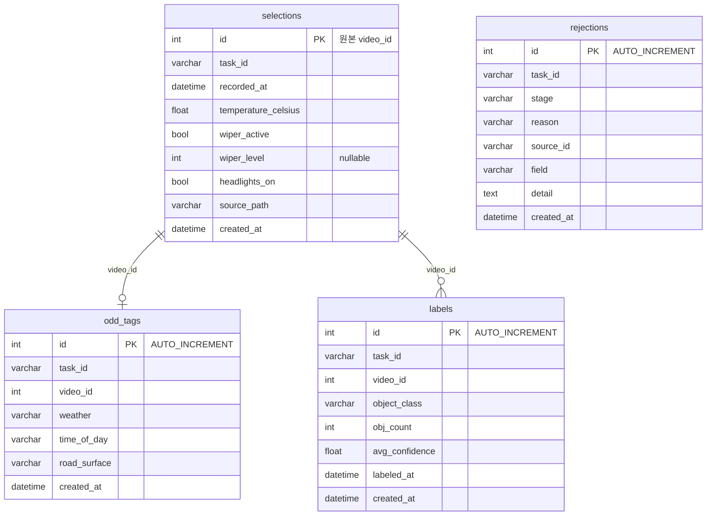

# 데이터 모델

> MySQL: 정제된 학습 데이터 / MongoDB: 원본 보관 + 작업 상태 관리

---

## MySQL

### ERD



> FK 없음. `selections.id`를 `odd_tags.video_id`, `labels.video_id`가 논리적으로 참조한다.

### 인덱스

**selections**

| 이름 | 컬럼 | 비고 |
|------|------|------|
| `ix_selections_task_id` | task_id | |

**odd_tags**

| 이름 | 컬럼 | 비고 |
|------|------|------|
| `ix_odd_tags_task_video` | (task_id, video_id) | UNIQUE |
| `ix_odd_tags_search` | (task_id, video_id, weather, time_of_day, road_surface) | 커버링 |

**labels**

| 이름 | 컬럼 | 비고 |
|------|------|------|
| `ix_labels_task_video_class` | (task_id, video_id, object_class) | UNIQUE |
| `ix_labels_search` | (task_id, object_class, obj_count, avg_confidence) | 커버링 |

**rejections**

| 이름 | 컬럼 | 비고 |
|------|------|------|
| `ix_rejections_task_stage_reason` | (task_id, stage, reason) | |
| `ix_rejections_source` | (task_id, source_id) | |

---

## MongoDB

### raw_data

원본 JSON/CSV 행을 변환 없이 보관.

```json
{
  "task_id": "550e8400-e29b-41d4-a716-446655440000",
  "source": "selections",
  "data": { ... },
  "created_at": "2026-04-11T10:00:00"
}
```

### analyze_tasks

분석 작업 상태 + 단계별 진행률. `_id` = task_id.

```json
{
  "_id": "550e8400-...",
  "status": "processing",
  "progress": {
    "selection":     { "total": 100, "processed": 95, "rejected": 5 },
    "odd_tagging":   { "total": 100, "processed": 80, "rejected": 3 },
    "auto_labeling": { "total": 300, "processed": 0,  "rejected": 0 }
  },
  "last_completed_phase": "odd_tagging",
  "result": null,
  "error": null,
  "created_at": "2026-04-11T10:00:00",
  "completed_at": null
}
```

### outbox

Transactional Outbox. `_id` = message_id.

```json
{
  "_id": "msg-uuid-001",
  "message_type": "ANALYZE",
  "payload": { "task_id": "550e8400-..." },
  "status": "pending",
  "retry_count": 0,
  "max_retries": 3,
  "created_at": "2026-04-11T10:00:00",
  "updated_at": "2026-04-11T10:00:00"
}
```

### 인덱스

| 컬렉션 | 인덱스 |
|--------|--------|
| raw_data | `(task_id, source)` |
| analyze_tasks | `(status)` |
| outbox | `(status, created_at)` |

---

## Enum 허용값

| 필드 | 허용값 |
|------|--------|
| weather | sunny, cloudy, rainy, snowy |
| time_of_day | day, night |
| road_surface | dry, wet, snowy, icy |
| object_class | car, pedestrian, traffic_sign, traffic_light, truck, bus, cyclist, motorcycle |
| stage | selection, odd_tagging, auto_labeling |
| status (task) | pending, processing, completed, failed |
| status (outbox) | pending, processing, published, failed |
| reason (rejection) | duplicate_tagging, duplicate_label, negative_obj_count, fractional_obj_count, invalid_format, unknown_schema, missing_required_field, invalid_enum_value, unlinked_record |
