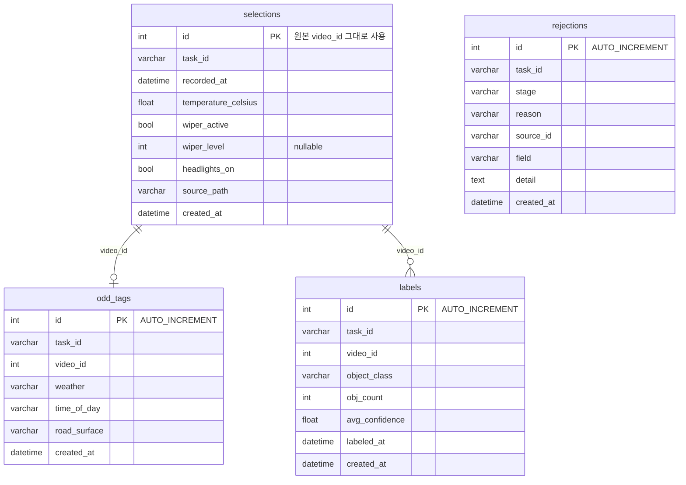
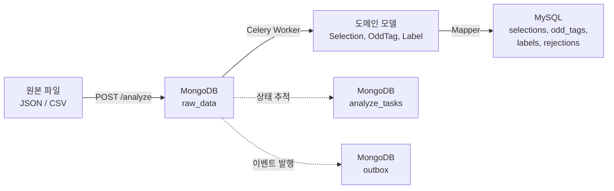

# 데이터 모델 & ERD

> 자율주행 학습 데이터 파이프라인의 저장소 설계 문서.
> MySQL은 **정제된 학습 데이터**, MongoDB는 **원본 보관 + 작업 상태 관리**를 담당한다.

---

## 1. MySQL — 정제된 학습 데이터

### ERD



> FK 제약 조건은 없다. `selections.id`를 `odd_tags.video_id`, `labels.video_id`가 논리적으로 참조한다.
> `rejections`는 `task_id` + `source_id`로 원본을 추적하며, 특정 테이블에 종속되지 않는다.

### 테이블 관계

| 관계 | JOIN 조건 | 카디널리티 |
|------|----------|-----------|
| selections ↔ odd_tags | `selections.id = odd_tags.video_id` | 1:1 (UNIQUE 제약) |
| selections ↔ labels | `selections.id = labels.video_id` | 1:N (객체 클래스별) |

### 인덱스

**selections**

| 이름 | 컬럼 | 용도 |
|------|------|------|
| `ix_selections_task_id` | task_id | task별 Selection 조회 |

**odd_tags**

| 이름 | 컬럼 | 용도 |
|------|------|------|
| `ix_odd_tags_task_video` | (task_id, video_id) | **UNIQUE** — 영상당 태그 1건 보장 |
| `ix_odd_tags_search` | (task_id, video_id, weather, time_of_day, road_surface) | 커버링 인덱스 — ODD 필터 조합 |

**labels**

| 이름 | 컬럼 | 용도 |
|------|------|------|
| `ix_labels_task_video_class` | (task_id, video_id, object_class) | **UNIQUE** — 영상+클래스당 1건 보장 |
| `ix_labels_search` | (task_id, object_class, obj_count, avg_confidence) | 커버링 인덱스 — Label 서브쿼리 최적화 |

**rejections**

| 이름 | 컬럼 | 용도 |
|------|------|------|
| `ix_rejections_task_stage_reason` | (task_id, stage, reason) | 거부 사유 분석 |
| `ix_rejections_source` | (task_id, source_id) | 원본 레코드 추적 |

---

## 2. MongoDB — 원본 보관 + 작업 관리

### raw_data

원본 JSON/CSV 행을 변환 없이 그대로 보관한다.

```json
{
  "task_id": "550e8400-e29b-41d4-a716-446655440000",
  "source": "selections",
  "data": {
    "id": 1,
    "recordedAt": "2026-01-11T06:58:26+09:00",
    "sensor": {
      "temperature": { "value": 38, "unit": "F" },
      "wiper": { "isActive": false, "level": 0 },
      "headlights": false
    },
    "sourcePath": "/data/processed/2026-01/00001.mp4"
  },
  "created_at": "2026-04-11T10:00:00"
}
```

### analyze_tasks

분석 작업의 상태와 단계별 진행률을 추적한다. `task_id`를 `_id`로 사용.

```json
{
  "_id": "550e8400-e29b-41d4-a716-446655440000",
  "status": "processing",
  "progress": {
    "selection":     { "total": 100, "processed": 95, "rejected": 5 },
    "odd_tagging":   { "total": 100, "processed": 80, "rejected": 3 },
    "auto_labeling": { "total": 300, "processed": 0,  "rejected": 0 }
  },
  "last_completed_phase": "odd_tagging",
  "result": null,
  "error": null,
  "created_at": "2026-04-11T10:00:00",
  "completed_at": null
}
```

### outbox

Transactional Outbox 패턴. 도메인 이벤트의 최소 1회 발행을 보장한다.

```json
{
  "_id": "msg-uuid-001",
  "message_type": "ANALYZE",
  "payload": { "task_id": "550e8400-..." },
  "status": "pending",
  "retry_count": 0,
  "max_retries": 3,
  "created_at": "2026-04-11T10:00:00",
  "updated_at": "2026-04-11T10:00:00"
}
```

### MongoDB 인덱스

| 컬렉션 | 인덱스 | 용도 |
|--------|--------|------|
| raw_data | `(task_id, source)` | 특정 task의 소스별 원본 일괄 조회 |
| analyze_tasks | `(status)` | 대기/처리 중 작업 목록 |
| outbox | `(status, created_at)` | 미발행 메시지 FIFO 폴링 |

---

## 3. 도메인 모델 ↔ DB 매핑

Mapper가 **Value Object 풀기/감싸기**와 **Enum ↔ str 변환**을 수행한다.

### Selection

| 도메인 필드 | 타입 | DB 컬럼 | 변환 |
|------------|------|---------|------|
| id | `VideoId` | id (int) | `.value` 추출 |
| temperature | `Temperature` | temperature_celsius (float) | `.celsius` 추출, 복원 시 `from_celsius()` |
| wiper | `WiperState` | wiper_active (bool) + wiper_level (int) | 1개 VO → 2개 컬럼으로 분리 |
| source_path | `SourcePath` | source_path (varchar) | `.value` 추출 |

### OddTag

| 도메인 필드 | 타입 | DB 컬럼 | 변환 |
|------------|------|---------|------|
| video_id | `VideoId` | video_id (int) | `.value` 추출 |
| weather | `Weather` | weather (varchar) | Enum `.value` ↔ `Weather()` |
| time_of_day | `TimeOfDay` | time_of_day (varchar) | Enum `.value` ↔ `TimeOfDay()` |
| road_surface | `RoadSurface` | road_surface (varchar) | Enum `.value` ↔ `RoadSurface()` |

### Label

| 도메인 필드 | 타입 | DB 컬럼 | 변환 |
|------------|------|---------|------|
| video_id | `VideoId` | video_id (int) | `.value` 추출 |
| object_class | `ObjectClass` | object_class (varchar) | Enum `.value` ↔ `ObjectClass()` |
| obj_count | `ObjectCount` | obj_count (int) | `.value` 추출 |
| confidence | `Confidence` | **avg_confidence** (float) | `.value` 추출 — **필드명 불일치 주의** |

### Rejection

| 도메인 필드 | 타입 | DB 컬럼 | 변환 |
|------------|------|---------|------|
| stage | `Stage` | stage (varchar) | Enum `.value` ↔ `Stage()` |
| reason | `RejectionReason` | reason (varchar) | Enum `.value` ↔ `RejectionReason()` |

### AnalyzeTask (MongoDB)

| 도메인 필드 | 타입 | 도큐먼트 필드 | 변환 |
|------------|------|-------------|------|
| task_id | `str` | _id | PK로 사용 |
| status | `TaskStatus` | status (str) | Enum ↔ str |
| selection_progress | `StageProgress` | progress.selection (중첩) | dataclass ↔ dict |
| last_completed_phase | `Stage` | last_completed_phase (str) | Enum ↔ str |

---

## 4. 데이터 생명주기

### 전체 흐름



### 단계별 설명

**① 적재 (Ingestion)** — `POST /analyze` 파일 업로드

원본 행을 MongoDB `raw_data`에 그대로 저장한다. 스키마 변환 없이 보관.

**② 정제 (Refinement)** — Celery Worker 비동기 처리

3단계 파이프라인을 순차 실행한다:

```
SELECTION     raw_data(source="selections") → Parser → Validator → Selection
ODD_TAGGING   raw_data(source="odds")       → Parser → Validator → OddTag
AUTO_LABELING raw_data(source="labels")     → Parser → Validator → Label
```

각 단계에서 실패한 레코드는 `Rejection`으로 수집된다.

**③ 저장 (Persistence)** — 정제 완료 후

Mapper가 도메인 모델의 VO/Enum을 원시 타입으로 풀어서 MySQL에 저장한다.

### 예시: video_id=1의 전체 여정

**원본** (selections.json):
```json
{
  "id": 1,
  "recordedAt": "2026-01-11T06:58:26+09:00",
  "sensor": { "temperature": { "value": 38, "unit": "F" }, "wiper": { "isActive": false, "level": 0 }, "headlights": false },
  "sourcePath": "/data/processed/2026-01/00001.mp4"
}
```

**정제 후 도메인 모델**:
```python
Selection(
    id=VideoId(1),
    temperature=Temperature(celsius=3.33),   # 38°F → 섭씨 변환
    wiper=WiperState(active=False, level=0),
    headlights_on=False,
    source_path=SourcePath("/data/processed/2026-01/00001.mp4"),
)
```

**MySQL 저장**:
| id | task_id | recorded_at | temperature_celsius | wiper_active | wiper_level | headlights_on | source_path |
|----|---------|-------------|---------------------|--------------|-------------|---------------|-------------|
| 1 | abc-123 | 2026-01-11 06:58:26 | 3.33 | false | 0 | false | /data/processed/2026-01/00001.mp4 |

같은 영상에 대한 ODD 태그와 라벨:

| odd_tags | video_id=1, weather=sunny, time_of_day=night, road_surface=dry |
|----------|----------------------------------------------------------------|
| labels   | video_id=1, object_class=car, obj_count=12, avg_confidence=0.97 |
| labels   | video_id=1, object_class=pedestrian, obj_count=24, avg_confidence=0.84 |
| labels   | video_id=1, object_class=traffic_sign, obj_count=6, avg_confidence=0.94 |

---

## 5. 인덱스 설계 근거

### QueryBuilder와 인덱스의 매칭

`DataSearchQueryBuilder`는 selections를 기준으로 odd_tags/labels를 동적 JOIN/서브쿼리한다.

```sql
-- ODD 조건이 있으면 JOIN
SELECT * FROM selections
  JOIN odd_tags ON selections.id = odd_tags.video_id
WHERE odd_tags.weather = 'rainy'
  AND odd_tags.road_surface = 'wet'

-- Label 조건이 있으면 서브쿼리
SELECT * FROM selections
WHERE id IN (
    SELECT video_id FROM labels
    WHERE object_class = 'car'
      AND obj_count >= 5
      AND avg_confidence >= 0.8
)
ORDER BY id LIMIT 20
```

### MySQL

| 인덱스 | 어떤 쿼리를 빠르게 하는가 |
|--------|------------------------|
| **selections** `(task_id)` | 거의 모든 쿼리의 시작점 — task별 필터링 |
| **odd_tags** `(task_id, video_id)` UNIQUE | JOIN 성능 + 영상당 태그 1건 보장 |
| **odd_tags** `(task_id, video_id, weather, time_of_day, road_surface)` | ODD 필터 조합 시 테이블 접근 없이 인덱스만으로 응답 (커버링) |
| **labels** `(task_id, video_id, object_class)` UNIQUE | 영상+클래스당 라벨 1건 보장 |
| **labels** `(task_id, object_class, obj_count, avg_confidence)` | Label 서브쿼리의 WHERE 절 커버링 |
| **rejections** `(task_id, stage, reason)` | "어떤 단계에서 어떤 이유로 거부?" 분석 |
| **rejections** `(task_id, source_id)` | 특정 원본 레코드의 거부 이력 추적 |

### MongoDB

| 인덱스 | 어떤 쿼리를 빠르게 하는가 |
|--------|------------------------|
| **raw_data** `(task_id, source)` | 정제 시 소스별 원본 일괄 조회 |
| **analyze_tasks** `(status)` | Worker가 대기 작업 폴링 |
| **outbox** `(status, created_at)` | 미발행 메시지를 FIFO로 소비 |

---

## 부록: Value Object & Enum 목록

### Value Objects

| VO | 타입 | 제약 | 비즈니스 로직 |
|----|------|------|-------------|
| `VideoId` | int | > 0 | 영상 식별자 |
| `Temperature` | float | -90 ~ 60 | `from_fahrenheit()` 변환 지원 |
| `Confidence` | float | 0.0 ~ 1.0 | `is_high()`, `is_low()` 판단 |
| `ObjectCount` | int | >= 0 | `is_empty()` 판단 |
| `WiperState` | bool + int? | level 0~3 | `is_raining_likely()` — level >= 2면 비 가능성 |
| `SourcePath` | str | .mp4 확장자 | `is_raw()`, `is_processed()` 경로 판단 |

### Enums (StrEnum)

| Enum | 값 |
|------|----|
| `Weather` | sunny, cloudy, rainy, snowy |
| `TimeOfDay` | day, night |
| `RoadSurface` | dry, wet, snowy, icy |
| `ObjectClass` | car, pedestrian, traffic_sign, traffic_light, truck, bus, cyclist, motorcycle |
| `Stage` | selection, odd_tagging, auto_labeling |
| `TaskStatus` | pending, processing, completed, failed |
| `OutboxStatus` | pending, processing, published, failed |
| `RejectionReason` | duplicate_tagging, duplicate_label, negative_obj_count, fractional_obj_count, invalid_format, unknown_schema, missing_required_field, invalid_enum_value, unlinked_record |
